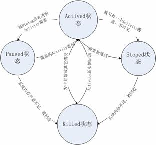

+++
title = "Android中的Activity"
date = "2019-07-02T09:30:00+08:00"
author = "do9core"
tags = ["Android"]
description = "Activity的学习小结"
readingTime = true
+++

## 定义

一种提供与用户交互的可视化界面的对象，代表了一整个屏幕可发生的活动

## Activity基本状态

* Active

新的Activity启动入栈后，在屏幕最前端，可见并且可以和用户交互。

* Paused

当Activity被透明或Dialog样式的Activity覆盖时的状态，此时它虽然仍可见，但是失去焦点不可与用户交互。

* Stopped

当Activity被另一个Activity覆盖、失去焦点、不可见时处于Stop状态。

* Killed

Activity被系统杀死回收或没被启动时处于Killed状态。

## Activity 栈

Android系统通过Activity栈管理Activity，一个Activity实例的状态决定其在栈中的位置。

* 顶层的Activity位于前台，处于Active状态
* 当顶层Activity因异常或其他原因被销毁，栈第二层的Activity就被激活，成为顶层Activity
* 新的Activity激活时，原顶层的Activity将成为第二层的Activity

除了顶层Activity外，其他Activity都有可能在内存不足时被回收，且Activity层级越低，越会优先被回收。  

系统在管理时，会根据Activity的状态来改变其在栈中的位置。

## 生命周期

| 方法                     | 调用时机                                                     | 使用场景                                                     |
| ------------------------ | ------------------------------------------------------------ | ------------------------------------------------------------ |
| `onCreate()`             | Activity被创建时（*生命周期的第一个方法*）                   | 初始化工作                                                   |
| `onNewIntent()`          | 与Activity启动模式相关                                       | （下文）                                                     |
| `onStart()`              | 在`onCreate()`后调用；或是Activity从Stop状态转换为Active状态时被调用,即`onRestart()`后（*此时Activity还不可见，无法与用户交互*） | 初始化工作                                                   |
| `onResume()`             | 在`onStart()`后调用；或是Activity从Pause状态转换为Active状态时被调用 | 数据恢复                                                     |
| `onWindowFocusChanged()` | Activity当前Window获得或失去焦点时（*真正的Visible节点*）    | 获取View的尺寸                                               |
| `onPause()`              | Activity从Active状态进入Pause状态时                          | 数据存储，停止动画，注销广播等（*为了新的Activity能尽快进入前台，尽量不要做耗时操作*） |
| `onStop()`               | Activity从Active状态进入Stop状态时                           | 状态保存                                                     |
| `onRestart()`            | Activity从Stop状态重新回到Active状态时                       | 数据恢复                                                     |
| `onDestory()`            | Activity被销毁时（*生命周期的最后一个方法*）                 | 回收工作，资源释放                                           |
| `finish()`               | 需要关闭Activity时调用                                       |                                                              |

### 补充

* `finish()`

    > Call this when your activity is done and should be closed.

    当Activity任务完成需要关闭时调用此方法。
    在按返回按钮时候也会被调用。

    此时可能并未调用`onDestroy()`方法

* `onDestroy()`

    > The system is temporarily destroying this instance of the activity to save space.

    系统要销毁Activity时调用，调用后Activity生命周期结束

* `onWindowFocusChanged()`

    当Activity对应的窗口焦点发生变化时调用，可以用于获取View尺寸

* `onNewIntent()`

    与Activity的启动模式相关：

    1. 在**Standard**模式下，不会触发`onNewIntent()`，因为总是会创建新的Activity，所以会触发`onCreate()`。可以用于需要多个实例的页面。
    2. 在**SingleTop**模式下，若要启动的Activity已在栈顶，那么会触发`onNewIntent()`将新的Intent传递给Activity，`onCreate()`和`onStart()`不会被触发。可以用于推送的详情页面。
    3. 在**SingleTask**模式下，若栈内存在要启动的Activity，不管它是否位于栈顶，将它之上的Activity全部出栈，然后触发`onNewIntent()`。可以用于整个App的首页。
    4. 在**SingleInstance**模式下，以此模式启动的Activity会单独占用一个Task栈，整个系统中只存在一个实例。后续启动Activity时，如果系统中存在，就会启动它并触发`onNewIntent()`。可以用于系统中的单一实例，如电话、短信等。

* Fragment的Host

    Activity作为Fragment最主要的Host存在，关于Fragment的介绍，请参考[Android中的Fragment](../android-fragment/)
