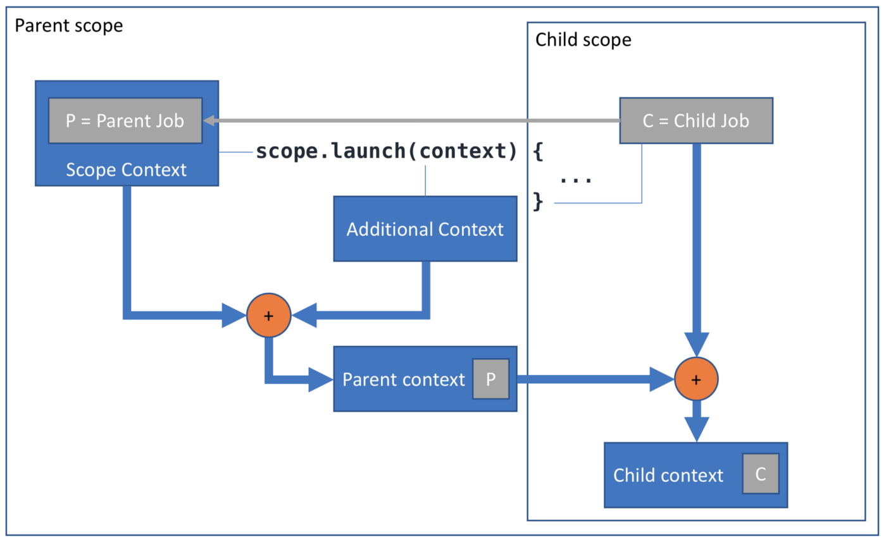

+++
title = "Kotlin协程上下文(Context)和作用域(Scope)"
date = "2021-07-20T09:34:00+08:00"
author = "do9core"
tags = ["Kotlin"]
description = "Kotlin中CoroutineScope和CoroutineContext的总结"
readingTime = true
+++

本文翻自Roman Elizarov撰写的Kotlin协程解析系列，原文：[Coroutine Context and Scope](https://medium.com/@elizarov/coroutine-context-and-scope-c8b255d59055)

Kotlin内的每一个协程，都有一个由`CoroutineContext`对象代表的上下文。一个上下文其实就是一组协程元素（`CoroutineContext.Element`），可以通过`coroutineContext`属性来访问协程的上下文：

```kotlin
fun main() = runBlocking<Unit> {
    println("My context is: $coroutineContext")
}

// My context is: [CoroutineId(1), "coroutine#1":BlockingCoroutine{Active}@73c6c3b2, BlockingEventLoop@48533e64]
```

协程上下文是不可变的，但是可以使用`plus()`来添加协程元素到上下文中，就像为集合添加元素一样，这会生成一个新的协程上下文：

```kotlin
fun main() = runBlocking<Unit> {
    println("A context with name: ${coroutineContext + CoroutineName("test")}")
}

// A context with name: [CoroutineId(1), "coroutine#1":BlockingCoroutine{Active}@73c6c3b2, CoroutineName(test), BlockingEventLoop@48533e64]
```

一个协程的本身是由一个`Job`对象表示的，它负责管理一个协程的生命周期、取消以及父子关系。当前的`Job`可以从`CoroutineContext`中取得：

```kotlin
fun main() = runBlocking<Unit> {
    println("My job is: ${coroutineContext[Job]}")
}

// My job is: "coroutine#1":BlockingCoroutine{Active}@6aa8ceb6
```

还有一个接口叫做`CoroutineScope`（作用域），这个接口里只定义了一个属性——`val coroutineContext: CoroutineContext`，除了上下文之外它什么也不再包含了。所以，这个接口为何存在，它与上下文本身有何区别？其实它们之间的区别和设计初衷相关。

一个典型的协程使用`launch`构造器来启动：

```kotlin
fun CoroutineScope.launch(
    context: CoroutineContext = EmptyCoroutineContext,
    // ...
): Job
```

这个构造器被定义为`CoroutineScope`的扩展函数，并且传入一个`CoroutineContext`作为参数，所以它实际上需要两个`CoroutineContext`（尽管`CoroutineScope`只有一个`CoroutineContext`的引用）。

那么`launch`构造器使用这两个`CoroutineContext`做了什么操作呢？它使用`plus()`操作，合并两个`CoroutineContext`的`Element`，同时会使参数`context`中的`Element`获得比调用的`CoroutineScope`中的`Element`更高的优先级。

最后，合并完毕的`CoroutineContext`会被用于启动一个新的协程，但是这个`CoroutineContext`并不是新启动协程的`CoroutineContext`，而是新启动协程的父级`CoroutineContext`。



新的协程会从调用者的`Job`中创建他自己的`Job`对象，之后，会把这个协程的Job对象和刚刚合并的`CoroutineContext`进行`plus()`操作，得到新的`CoroutineContext`，这个`CoroutineContext`才是新启动协程内得到的。

这样设计的目的是希望`CoroutineScope`在一个可管理的范围内创建协程。通常来说，一个`CoroutineScope`内的`CoroutineContext`包含一个`Job`元素，这个`Job`元素将会成为在这个`Scope`内创建的新协程的父级。(`GlobalScope`是一个例外，它不包含`Job`，应该避免用它启动协程)

另一方面，`launch`构造器中的`context`参数设计初衷，是希望能够使用传入的`context`来替换当前作用域内`context` 的一些元素，进而实现改变一些当前Scope下的行为。例如：

```kotlin
fun main() = runBlocking<Unit> {
    launch(CoroutineName("child")) {
        println("My context is $coroutineContext}")
    }
}

// My context is [CoroutineName(child), CoroutineId(2), "child#2":StandaloneCoroutine{Active}@5eb5c224, BlockingEventLoop@53e25b76]}
```

尽量不要将带有`Job`元素的`CoroutineContext`传入`launch`构造器，因为这样做会破坏协程的父子关系，除非我们明确表示不需要父子关系，比如使用`NonCancellable`的`Job`。

此外请注意，`launch`构造器中的`block`，也需要接受一个`CoroutineScope`参数：

```kotlin
fun CoroutineScope.launch(
    // ...
    block: suspend CoroutineScope.() -> Unit
): Job
```

通常，所有的构造器都应该遵守以下约定：`CoroutineScope`内的`CoroutineContext`应该和`block`内的`CoroutineContext`相同：

```kotlin
fun main() = runBlocking<Unit> {
    launch { scopeCheck(this) }
}

suspend fun scopeCheck(scope: CoroutineScope) {
    println(scope.coroutineContext === coroutineContext)
}

// true
```

这样，当我们在代码中看到一个无限制条件的的coroutineContext引用时，由于它们始终是相同的设计，因此对应命名的[top-level property](http://kotlinlang.org/api/latest/jvm/stdlib/kotlin.coroutines/coroutine-context.html)和[scope’s property](https://kotlin.github.io/kotlinx.coroutines/kotlinx-coroutines-core/kotlinx.coroutines/-coroutine-scope/coroutine-context.html)之间就没有混淆。

因为`CoroutineContext`和`CoroutineScope`在本质上是一样的，所以我们可以不通过`GlobalScope`来启动协程，而是直接通过`CoroutineContext`创建`CoroutineScope`对象：

```kotlin
suspend fun doNotDoThis() {
    CoroutineScope(coroutineContext).launch {
        println("I'm confused.")
    }
}
```

但是最好别这么干，这会使这个`CoroutineScope`启动的协程不透明，应该通过捕获外部的`Job`的方式来启动新协程，而不是声明在函数中，一个协程通常需要与其他的代码合作，所以它的启动必须明确父子关系。

如果你希望启动一个在函数返回后继续运行的协程，请将你的函数设计成`CoroutineScope`的扩展函数，或者将`CoroutineScope`作为参数传递给你的函数。通过这种设计来使你的函数签名更加清晰，同时，不要用`suspend`修饰这些函数：

```kotlin
fun CoroutineScope.doThis() {
    launch { println("I'm fine") }
}

fun doThatIn(scope: CoroutineScope) {
    scope.launch { println("I'm fine, too") }
}
```

另一方面，挂起函数是被设计为非阻塞的，它不应该具有启动其他并发工作的副作用。

挂起函数应该等待其所有工作完成后，再返回调用者。（换而言之，挂起函数内不要搞并发，不要调用后直接返回，然后在后台干一些奇怪的事）。
