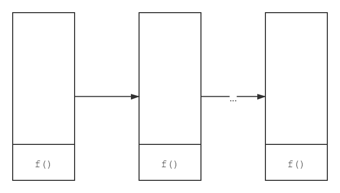

+++
title = "Kotlin尾递归优化"
date = "2021-07-20T09:27:00+08:00"
author = "do9core"
tags = ["Kotlin"]
description = "尾递归优化和在Kotlin中的使用"
readingTime = true
+++

尾递归是个啥，为啥要优化它？

要了解尾递归，首先要了解一下什么是尾调用

## 尾调用

其实顾名思义，尾调用就是指，在一个函数的最后调用另一个函数的操作，举个例子就如：

```kotlin
fun g(parameter: Int) { /* ... */ }

fun f() {
    val x = 1
    val y = 2
    g(x + y) // 尾调用
}
```

因为`g()`在`f()`的最后被调用，即`g()`之后不存在任何其他函数调用，所以`g()`就是一个尾调用

## 尾递归

了解了尾调用，尾递归也就显而易见了，就是在一个递归中，调用自身的过程是最后一步，比如：

```kotlin
fun f(parameter: Int) {
    if (parameter < 0) {
        return
    }
    f(parameter - 1)
}
```

这就是一个尾递归的例子。

### 尾递归的问题

尾递归存在什么问题呢？我们为什么要对它进行优化？

我们知道递归函数虽然写起来很方便，可读性也佳，但是有一个问题，就是可能产生著名的`StackOverflowError`（即栈溢出）异常。

从操作系统的学习中我们可以了解到，函数调用相比循环是存在一个很明显的代价的，就是需要将当前使用到的数据入栈，形成一个栈帧，然后开始下一个函数的调用。

通常情况下，这种方式不会产生问题，因为一旦函数调用完毕，栈帧就会被从栈中弹出。

但是在递归过程中，对一个函数的调用的次数可能非常多，这就给栈造成了很大的压力：


通常的递归我们可能没有什么办法，只能改用循环，但是对于尾递归，我们可以做一些优化，使其不发生栈溢出错误，优化的预期如下：



这样就可以如循环一般持续运行而不会发生栈溢出

### Kotlin的尾递归优化

在Kotlin中，使用关键字`tailrec`可以告诉编译器，对函数进行尾递归优化，`tailrec`其实就是`tail recrusive`（即尾递归）的缩写，下面我们就举个例子来演示一下它的用法

### 例子：求阶乘

对于求阶乘，最简单的写法如下

```kotlin
fun factorial(n: BigInteger): BigInteger {
    if (n <= BigInteger.ZERO) {
        return BigInteger.ONE
    }
    return n * factorial(n - BigInteger.ONE)
}
```

这个方法在`n`较小的情况下可以成功求解，但是如果`n`值很大，很快就会发生栈溢出，所以需要对它进行一个尾递归优化。

但是，如果直接对这个函数添加`tailrec`是没有效果的。

因为这个函数最后调用的是`BigInteger::times`即`*`，而不是`factorial()`本身，所以我们需要对这个方法进行一个小小的改造：

```kotlin
private tailrec fun factorial(
    n: BigInteger, 
    currentResult: BigInteger // 将计算结果传入
): BigInteger {
    if (n <= BigInteger.ZERO) {
        return currentResult
    }
    return factorial(n - BigInteger.ONE, currentResult * n)
}

// 对外开放的封装
fun factorial(n: BigInteger): BigInteger = 
    factorial(n, BigInteger.ONE)
```

将每轮计算的结果作为参数传给下一次，确保每次的最后调用函数自身，即可使用`tailrec`关键字使用Kotlin编译器的尾递归优化。

使用这个进行过尾递归优化的函数，就可以对`n`很大的情况进行求解了。
