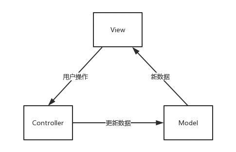

+++
title = "Android中的MVC、MVP与MVVM"
date = "2020-02-11T21:07:00+08:00"
author = "do9core"
tags = ["Android", "Architecture"]
description = "总结对比Android中的MVC，MVP和MVVM"
readingTime = true
+++

## 目的

* 利于组件复用
* 利于开发过程中进行分工，提高程序开发的效率
* 更容易进行后续的测试以及定位问题

## MVC

### Model-View-Controller

#### MVC的概念

* 模型（Model）

针对业务建立的数据结构和相关类。

* 视图（View）

用于对数据进行展示，对用户的输入进行传递。

* 控制器（Controller）

主要包含控制逻辑，用于协调模型和视图，处理业务逻辑。

---

MVC程序与用户的交互流程如下：

1. View收到用户的操作后，把处理权移交给Controller
2. Controller执行相关的业务逻辑，这些业务逻辑可能需要对Model进行相应的操作
3. Model变更后通知View
4. View收到Model变更的消息后，向Model请求最新的数据，然后更新

这个流程体现了MVC的几个特点：

1. Controller不操作View
2. View不执行业务逻辑
3. View和Model间的同步，由Model通知，View执行

#### MVC的优点

实现了数据、界面元素、业务逻辑的分离，MVC每个部分各自承担自己的职责。

#### MVC的不足

* 增加系统结构和实现的复杂性，不适合小、中规模的应用
* 不易测试，因为View与Model的请求由View发起，而View依赖UI存在，在没有UI的单元测试情况下难以进行测试
* 不易复用，因为View依赖于特定的Model

### Android的MVC

* Model: 实体模型
* View: xml布局 & Activity(Fragment)
* Controller: Activity(Fragment)

在Android中，xml文件只为显示提供布局，没有其他功能，很多View相关的操作需要在Activity中完成，所以Activity不仅承担了Controller的功能，还需要承担一些View的功能。

## MVP

### Model-View-Presenter

#### MVP的概念

* 模型（Model）

针对业务建立的数据结构和相关类。

* 视图（View）

用于对数据进行展示，对用户输入进行传递。

* Presenter

负责对用户输入进行响应，处理业务逻辑，更新模型和视图。

---

在MVP中，Model和View不再直接发生关系，他们之间的数据交互通过Presenter来执行。

MVP程序与用户交互的流程如下：

1. View收到用户的操作后，将处理权移交Presenter
2. Presenter执行相关的业务逻辑，并且对Model进行更新
3. Model更新后，Presenter通过View提供的接口更新View

这个流程体现出了MVP的一些特点：

1. View不再直接与Model同步，而是由Presenter负责
2. Presenter需要持有View的引用来更新View

#### MVP的优点

* 利于测试

因为业务逻辑转移到了Presenter中，测试的重点就可以集中在Presenter上，此外，因为View和Presenter通过接口通信，很容易使用Mock方法对Presenter进行测试。

* 降低耦合

View和Model不直接进行通信，实现了分离，模块职责的划分更加明显，层次清晰。

#### MVP的不足

* Presenter复杂度高

View和Presenter通过接口通信，在业务逻辑增加时，Presenter的复杂性会急剧上升，并且和View间产生大量接口，不利于管理；Presenter除了处理业务逻辑，还需要进行View的手动更新，不易维护。

* Presenter与View耦合

因为Presenter要处理View的更新，所以一旦View发生变更，Presenter也需要同时变更。

### Android的MVP

* Model: 实体模型
* View: xml布局 & Activity(Fragment)
* Presenter: 独立定义的Presenter，负责处理Model和View的交互

使用MVP可以将Activity(Fragment)中的业务逻辑分离出来交由Presenter处理，在Presenter中，只需要持有Activity(Fragment)作为View的引用，然后调用相关接口进行View操作即可，让Activity(Fragment)成为彻底的View，只做与UI相关的事。

## MVVM

### Model-View-ViewModel

#### MVVM的概念

* 模型（Model）

针对业务建立的数据结构和相关类，与MVP中的Model功能相同。

* 视图（View）

用于对数据进行展示，对用户输入进行传递。

* ViewModel

负责对用户输入进行响应，处理业务逻辑。除此之外，还需要持有View的状态，View上展示的数据全部来自ViewModel，ViewModel是View状态的权威来源。

---

与MVP不同，在MVVM中，View和ViewModel通过数据绑定（Data  Binding）进行关联，View和ViewModel不需要持有对方的引用，当View上的数据更新时会反映到ViewModel上，反之亦然。

ViewModel只负责将需要展示的数据暴露给View，如何进行展示交由View处理，所以在分离上做的更加彻底。

#### MVVM的优点

* 降低耦合

View进一步独立于ViewModel，通过绑定方式进行View和ViewModel的数据同步，消除了MVP中Presenter需要持有View引用并且需要手动更新的不足。

* 可重用

与MVP中相反，ViewModel成为View的主导者，一个ViewModel可以绑定到不同布局的View上，让多个View重用这些逻辑。

* 利于测试

与MVP相似，MVVM分离了View和Model，并且业务逻辑集中在ViewModel上，便于针对ViewModel进行测试。

#### MVVM的不足

* 由于View和ViewModel是通过绑定方式实现的，这些数据绑定的声明不利于Debug
* 并非View上的所有状态都适合使用绑定实现，使得MVVM在处理某些操作时过于复杂。

### Android的MVVM

* Model: 实体模型
* View: xml布局 & Activity(Fragment)
* ViewModel: 独立定义的ViewModel，负责为View提供数据，处理业务逻辑

在MVP中，需要先处理业务逻辑，更新数据，然后根据数据变化获取View的引用更新View。

但是MVVM中，ViewModel不处理View的变化，只处理数据，View的变化通过绑定引擎实现（在Android中使用Data Binding）。

相对MVC，MVVM与MVP一样，使Activity(Fragment)的彻底成为View，只做和UI相关的事。

实现Android的MVVM有两种方式：

* `BaseObservable`（`ObservableField`） + `DataBinding`
* `ViewMode` + `LiveData`（RxJava）

## 参考资料

1. [MVC MVP MVVM Redux 架构介绍](https://zhuanlan.zhihu.com/p/59814282)
2. [谈谈UI架构设计的演化](https://www.cnblogs.com/winter-cn/p/4285171.html)
3. [MVC MVP和MVVM](https://juejin.im/post/5cc12135e51d456e831f6951#heading-0)
4. [Android框架MVC、MVP和MVVM探究](https://blog.csdn.net/chaoshenzhaoxichao/article/details/79871145)
5. [MVC、MVP、MVVM，我到底该怎么选？](https://blog.csdn.net/singwhatiwanna/article/details/80904132)
6. [Android MVVM模式的理解](https://www.jianshu.com/p/4830912f5162)
7. [MVC，MVP 和 MVVM 模式如何选择？](https://zhuanlan.zhihu.com/p/38108311)
8. [GUI Architectures](https://martinfowler.com/eaaDev/uiArchs.html)
9. [认清Android框架 MVC，MVP和MVVM](https://blog.csdn.net/jdsjlzx/article/details/51174396)
10. [你对MVC、MVP、MVVM 三种组合模式分别有什么样的理解？](https://www.zhihu.com/question/20148405)
11. [Android App的设计架构：MVC,MVP,MVVM与架构经验谈](https://www.tianmaying.com/tutorial/AndroidMVC)
12. [Android App的设计架构：MVC,MVP,MVVM与架构经验谈](https://www.cnblogs.com/wytiger/p/5305087.html)
13. [深入分析MVC、MVP、MVVM、VIPER](https://juejin.im/post/59fc625d51882529c0468dc9#heading-34)
14. [杂谈: MVC/MVP/MVVM](https://juejin.im/post/5a30c77df265da43062ac189#heading-0)
