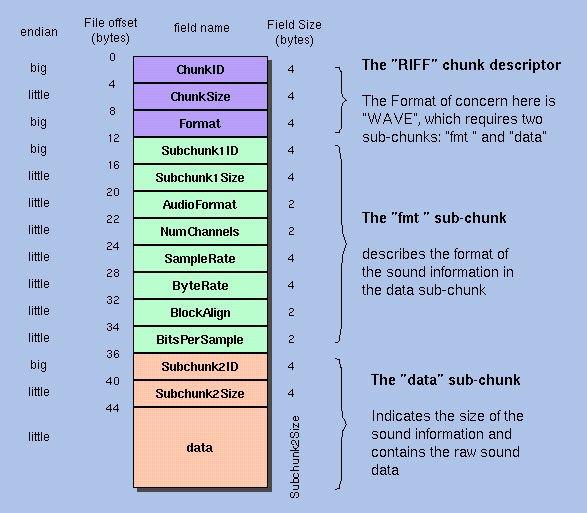

+++
title = "软件解码方式读写/裁剪Wav文件"
date = "2021-07-20T23:52:00+08:00"
author = "do9core"
tags = ["音视频"]
description = "WAV格式解析与软解，裁剪"
readingTime = true
+++

## Wav文件结构



Wav文件大致结构、文件头各字节数据如上图所示。

其中文件头尺寸为44字节。

## 读取文件

根据上图中的数据格式，读取输入文件的前44字节来获取音频的属性。

## 获取时间与字节的对应关系

根据时间来裁剪音频文件时，需要知道音频时间对应的字节位置。

要想获取这个数值，有两个需要关心的值：`ByteRate`和`BlockAlign`。

* `ByteRate`（比特率）

  `ByteRate`记录了每秒钟对应的字节数量，可以从文件头的 $[24, 28)$ 字节中读取。

* `BlockAlign`

  `BlockAlign`记录了一个音频采样数据的字节尺寸，用于在读写时进行对齐，防止读取或写入错误的数据。

## 计算字节位置

成功获取`ByteRate`和`BlockAlign`后，我们就可以开始计算对应时间的字节起始位置了。

对于一个确定的时间点`time`（以ms为单位），计算方式如下：

```latex
$BytePosition={ByteRate\times{time} - (ByteRate\times{time}\mod{BlockAlign})}$
```

根据这个公式分别计算起始位置和结束位置

将两点间的字节复制到新的文件，就获得了一个截取片段的PCM文件

## 计算文件头

因为在截取过程中没有进行任何音频格式的改变，所以除了`data`长度（音频数据的字节数）外，不需要重新计算文件头的其他数据。

文件头中，各个数据的计算方式如下：

| 位置       | 示例值   | 计算方式                                                    |
| ---------- | -------- | ----------------------------------------------------------- |
| $[1, 4]$   | "RIFF"   | 固定值`"RIFF"`                                              |
| $[5, 8]$   | 文件大小 | 整个文件的大小（包括数据和头的总大小）                      |
| $[9, 12]$  | "WAVE"   | 固定值`"WAVE"`                                              |
| $[13, 16]$ | "fmt "   | 固定值`"fmt "`（有一个空格）                                |
| $[17, 20]$ | 16       | 上述信息的大小，固定值16                                    |
| $[21, 22]$ | 1        | 音频数据格式，PCM时为1                                      |
| $[23, 24]$ | 2        | 音频声道数量                                                |
| $[25,28]$  | 44100    | 音频采样率                                                  |
| $[29,32]$  | 176400   | ${SampleRate}\times{BitsPerSample}\times{Channels}\div {8}$ |
| $[33,34]$  | 4        | ${BitsPerSample}\times{Channels}\mod {8}$                   |
| $[35,36]$  | 16       | 当个采样的采样位数                                          |
| $[37,40]$  | "data"   | 固定值`"data"`                                              |
| $[41, 44]$ | 数据大小 | 文件内部的数据大小                                          |

## 裁剪流程

```goat
             Source File             Clip File
            +-----------+          +-----------+
            |           |          |           |
            |           |          |           |
            +-----------+          +-----------+
            | File size |=========>| New size  |
            +-----------+          +-----------+
            |           |          |           |
            |           |          |           |
            +-----------+          +-----------+
 Header end | Data size |=========>| New size  |
- - - - - - +-----------+- - - - - +-----------+
            |           |          | Data to   |
 Clip start |           |     .--->| Clip      |
------------+-----------+    /     |           |
     [1]    | Data to   |   /      +-----------+
            | Clip      +--.
 Clip end   |           |
------------+-----------+
```

备注：

1. 使用`比特率*时间`分别计算起始和结束字节的位置
